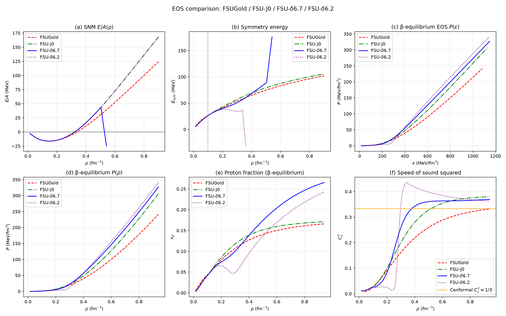

| 模型 | n₀ (fm⁻³) | E₀ (MeV) | K₀ (MeV) | E_sym(n_c) | L(n_c) |
|---|---|---|---|---|---|
| FSUGold | 0.1474 | −16.30 | 225.1 | 26.51 | 50.6 |
| FSU-J0 | 0.1478 | −16.31 | 227.9 | 26.34 | 56.9 |
| FSU-δ6.7 | 0.1477 | −16.31 | 227.7 | 26.23 | 57.2 |
| FSU-δ6.2 | 0.1460 | −16.31 | 218.5 | 26.25 | 58.4 |

