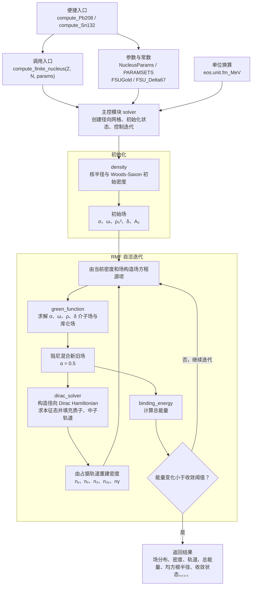

# 有限核计算程序架构

本文对应 `RMFCalculator.eos.finite_nucleus` 当前实现。

## 模块职责

- `solver`：创建径向网格，协调场与密度更新，并检查能量收敛。
- `density`：提供核半径和 Woods-Saxon 初始密度；迭代中的密度由 Dirac 轨道重建。
- `green_function`：根据源项求解介子场和库仑场。
- `dirac_solver`：在给定平均场中求解单粒子态，填充质子和中子轨道并生成密度。
- `binding_energy`：计算总能量，用于自洽收敛判断及最终结果。
- `params`：定义核物质模型参数集。

## 能量计算说明

当前总能量由液滴模型项、场能项和质心修正组成。Dirac 轨道能量用于构造轨道与更新密度，没有直接作为单粒子能量项加入总能量。